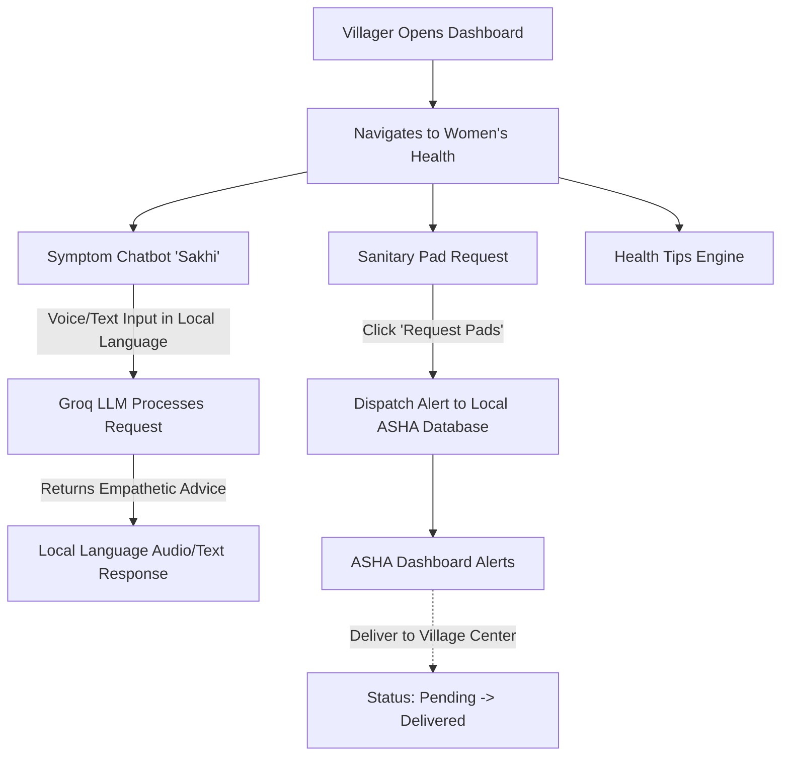

# SwasthAI: Menstrual Health Care System ("Sakhi" AI)

## 1. System Architecture
Designed specifically to respect the privacy and cultural context of rural India, the Menstrual Health Care System operates seamlessly within the Villager Dashboard with strict data privacy:
- **Zero-PII Prompts**: The "Sakhi" AI assistant does not send names or phone numbers to the LLM. Only the raw conversational context is processed.
- **Groq-Powered Intelligence**: Uses ultra-fast Groq LLM API to provide real-time, culturally sensitive, and medically accurate advice regarding menstrual health, hygiene, and reproductive care.
- **Native Localization**: Fully integrates with the `LanguageContext` architecture, allowing users to interact with the Menstrual Health portal in Hindi, Marathi, Tamil, Bengali, and English.

## 2. User Flow Diagram

## 3. UI Design Implementation ("Luminous Emerald Light")
- **Empowering Colors**: Uses soft Emerald, Indigo, and Rose tones rather than aggressive medical reds, creating a calming, premium, and private aesthetic.
- **Non-Textual Navigation**:
  - 💬 **Message Bubble**: Sakhi AI Assistant
  - 📦 **Package Icon**: Direct Sanitary Pad Request
  - 🌟 **Star Icon**: Health Tips
- **Big Element Philosophy**: Target zones for buttons and inputs are expanded to accommodate users unfamiliar with touch screens.

## 4. AI Logic & Pad Request Strategy
- **Sakhi AI Guardrails**: The Groq prompt is strictly instructed to act as a supportive rural health worker, preventing hallucinatory diagnoses and always suggesting physical consultation for severe pain.
- **Ephemeral Syncing**: Pad requests are sent to the SQLite backend with just a timestamp, location string, and village identifier.
- **Supply Chain Integration**: District hospitals analyze anonymous macro-data (e.g., "Village B has 50 pad requests this month") via the Admin Dashboard to intelligently route physical supplies to the right ASHA outposts ahead of time.
